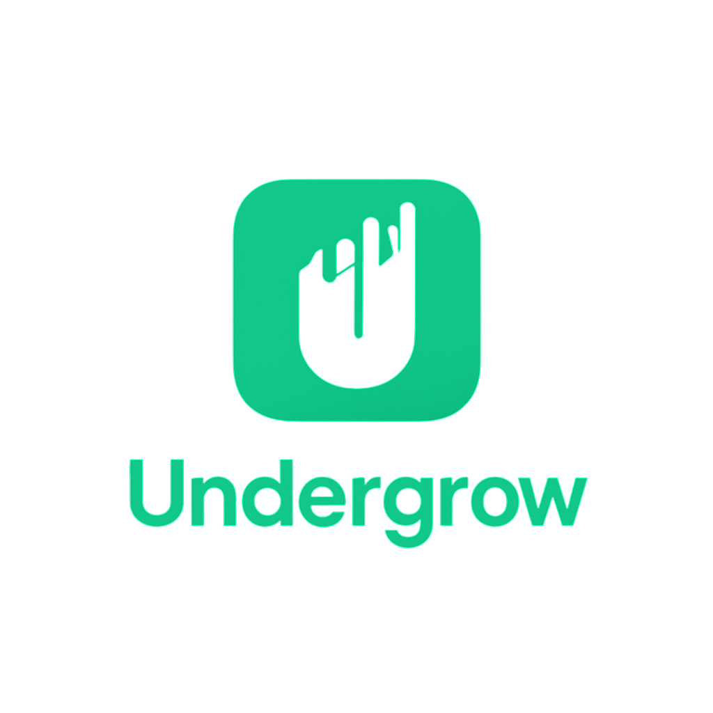

# Undergrow 🌿 - Tu Red Social

<p align="center">
  
</p>
> _Una aplicación móvil para conectar y compartir, desarrollada con React Native y Expo._

---

## ✨ Características Principales

- 👤 **Autenticación:** Registro e Inicio de Sesión de usuarios (conectado a backend Spring Boot).
- 🏠 **Feed Principal:** Scroll infinito (planeado) con publicaciones de usuarios.
- 🖼️ **Posts:** Visualización de posts con imagen, descripción, usuario.
- ❤️ **Interacciones:** Sistema de "Me Gusta", "Guardar" y "Comentar" en posts (con estado visual).
- 💬 **Mensajes:** Sección dedicada para chats entre usuarios (en desarrollo).
- ➕ **Crear Post:** Funcionalidad para añadir nuevas publicaciones (botón central).
- 🔍 **Búsqueda:** Sección para descubrir contenido o usuarios (en desarrollo).
- 👤 **Perfil:** Pantalla de perfil de usuario con opción de cerrar sesión.
- 🌍 **Multi-idioma:** Soporte para diferentes idiomas usando `i18next` (Español/Inglés configurados).
- 🎨 **Tema Dinámico:** Adaptación a modo claro/oscuro del dispositivo.
- ⚙️ **Navegación Moderna:** Uso de Expo Router para una navegación basada en archivos.
- 🔒 **Seguridad:** Gestión de sesión mediante tokens y almacenamiento seguro (`expo-secure-store`).

## 🛠️ Stack Tecnológico

- 📱 **Frontend:** React Native (gestionado con Expo)
- 🧭 **Navegación:** Expo Router v3
- ✍️ **Lenguaje:** TypeScript
- 🎨 **UI:** Componentes Nativos + StyleSheet
- ⚙️ **Gestión de Estado:** React Context API (para Autenticación)
- 📡 **Peticiones HTTP:** Axios
- 🌍 **Internacionalización (i18n):** `i18next`, `react-i18next`, `expo-localization`
- 🛡️ **Almacenamiento Seguro:** `expo-secure-store`
- 🔧 **Variables de Entorno:** `dotenv`, `expo-constants`, `app.config.js`
- 🧩 **Iconos:** `@expo/vector-icons`
- **Backend:** API REST desarrollada con Spring Boot (Java) - _(Repositorio/Ejecución separada)_
- 💾 **Base de Datos:** _(La que use tu backend Spring Boot, ej: PostgreSQL, MySQL)_

## 🚀 Empezando

Sigue estos pasos para configurar y ejecutar el proyecto en tu entorno local.

### Prerrequisitos

- **Node.js:** Versión LTS recomendada (v18+). Puedes verificar con `node -v`.
- **npm** o **yarn:** Gestor de paquetes de Node.js.
- **Git:** Sistema de control de versiones (`git --version`).
- **Expo Go App:** Instala la aplicación Expo Go en tu dispositivo móvil (iOS/Android) desde la App Store / Google Play.
- **Backend Spring Boot:** Asegúrate de que el [servidor backend de Undergrow](URL_A_TU_REPO_BACKEND_SI_EXISTE) esté configurado y ejecutándose localmente o en un entorno accesible.

### Instalación

1.  **Clonar el repositorio:**

    ```bash
    git clone <URL_DEL_REPOSITORIO_FRONTEND>
    cd Undergrow # O el nombre de la carpeta del proyecto
    ```

2.  **Configurar Variables de Entorno:**

    - Crea una copia del archivo de ejemplo `.env.example` (si no existe, créalo tú y añade `API_BASE_URL`):
      ```bash
      cp .env.example .env
      ```
    - Edita el archivo `.env` y establece el valor correcto para `API_BASE_URL` apuntando a tu backend en ejecución (ej: `API_BASE_URL=http://192.168.1.100:8080`).
    - **¡Importante!** Asegúrate de que `.env` esté en tu archivo `.gitignore`.

3.  **Instalar Dependencias:**
    ```bash
    npm install
    # o si usas yarn:
    # yarn install
    ```

## ▶️ Ejecutar la App

1.  **Iniciar el Servidor de Desarrollo Expo:**

    ```bash
    npx expo start
    ```

    - **(Opcional) Limpiar Caché:** Si encuentras problemas extraños, puedes intentar limpiar la caché: `npx expo start -c`

2.  **Abrir en el Móvil:**
    - Se abrirá una pestaña en tu navegador con el Metro Bundler y un código QR.
    - Abre la app **Expo Go** en tu teléfono.
    - Escanea el código QR mostrado en la terminal o en el navegador.
    - **Nota:** Tu teléfono y tu ordenador deben estar en la **misma red Wi-Fi**.

## 🌳 Flujo de Trabajo con Git (Rama `develop`)

Somos dos desarrolladores trabajando principalmente sobre la rama `develop`. Es **crucial** seguir estos pasos para evitar conflictos y mantener la rama actualizada:

1.  🔄 **Actualiza tu `develop` local:** Antes de empezar a trabajar o de subir tus cambios, asegúrate de tener la última versión de la rama `develop` remota:

    ```bash
    git switch develop
    git pull origin develop
    ```

2.  🌿 **(Opcional pero Recomendado) Crea una Rama para tu Feature/Fix:** Para mantener `develop` limpio, trabaja en una rama separada:

    ```bash
    git switch -c nombre-corto-de-tu-feature # ej: git switch -c feature/nuevo-filtro-feed
    ```

3.  💻 **Trabaja en tus Cambios:** Haz las modificaciones necesarias en el código.

4.  💾 **Guarda tus Cambios (Commit):**

    ```bash
    git add . # Añade todos los archivos modificados/nuevos
    git commit -m "Mensaje descriptivo de tus cambios" # Escribe un buen mensaje de commit
    ```

5.  🔄 **¡MUY IMPORTANTE! Vuelve a Actualizar `develop` ANTES de Subir:** Antes de intentar subir tus cambios (o fusionar tu rama de feature), asegúrate de que nadie más haya subido cambios a `develop` mientras trabajabas:

    ```bash
    git switch develop
    git pull origin develop
    ```

6.  🔗 **(Si usaste rama de feature) Fusiona `develop` en tu Rama:** Vuelve a tu rama y fusiona los últimos cambios de `develop`. Resuelve cualquier conflicto que pueda surgir:

    ```bash
    git switch nombre-corto-de-tu-feature
    git merge develop
    # (Resuelve conflictos si los hay, luego haz commit de la fusión)
    # git add .
    # git commit -m "Merge branch 'develop' into feature/..."
    ```

7.  ⬆️ **Sube tus Cambios:** Ahora sí, sube tu rama `develop` (o tu rama de feature) al repositorio remoto:
    - Si trabajaste directamente en `develop`:
      ```bash
      git push origin develop
      ```
    - Si trabajaste en una rama de feature (después de fusionar `develop` en ella):
      ```bash
      git push origin nombre-corto-de-tu-feature
      ```
      _(Luego podrías abrir un Pull Request en GitHub/GitLab si usan ese flujo)_

⚠️ **Regla de Oro:** Siempre haz `git pull origin develop` en tu rama `develop` local **justo antes** de hacer `git push origin develop` para minimizar conflictos. Si `git pull` trae cambios, asegúrate de que todo siga funcionando antes de subir.

## 📂 Estructura del Proyecto (Simplificada)

.
├── app/ # Pantallas y Navegación (Expo Router)
│ ├── (tabs)/ # Grupo para pantallas con barra de pestañas
│ │ ├── \_layout.tsx # Define el layout de las pestañas (Tabs Navigator)
│ │ ├── index.tsx # Pantalla del Feed principal (1ª pestaña)
│ │ ├── search.tsx # Pantalla de Búsqueda (2ª pestaña)
│ │ ├── addPost.tsx # Pantalla Placeholder Añadir (3ª pestaña)
│ │ ├── messages.tsx # Pantalla de Mensajes (4ª pestaña)
│ │ └── profile.tsx # Pantalla de Perfil (5ª pestaña)
│ ├── \_layout.tsx # Layout Raíz (Stack Navigator, AuthProvider, Redirecciones)
│ └── auth.tsx # Pantalla de Autenticación (Login/Registro)
├── assets/ # Recursos estáticos (imágenes, fuentes)
├── components/ # Componentes reutilizables (UI, navegación)
├── constants/ # Valores constantes (Colores, Tema)
├── context/ # Context API (AuthContext)
├── hooks/ # Hooks personalizados (useColorScheme)
├── localization/ # Configuración y archivos de traducción (i18n)
├── .env # Variables de entorno locales (API_URL) - ¡NO SUBIR A GIT!
├── app.config.js # Configuración de Expo (lee .env)
├── i18n.config.js # Configuración de i18next
├── package.json # Dependencias y scripts del proyecto
└── README.md # ¡Este archivo!

---

¡Feliz codificación! 😊
